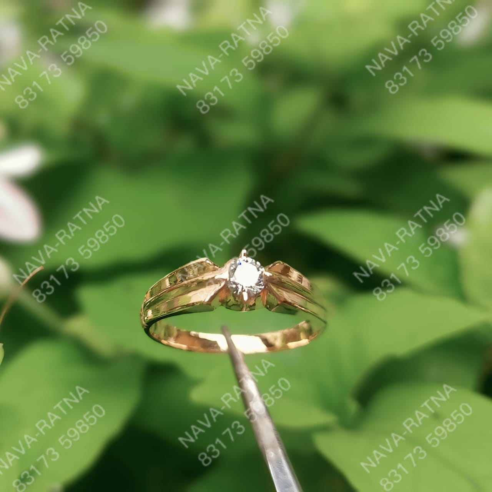

<!DOCTYPE html>
<html lang="en">
<head>
  <meta charset="UTF-8" />
  <meta name="viewport" content="width=device-width, initial-scale=1.0" />
  <title>Gold Rings by Your Brand</title>

  <!-- Google Fonts -->
  <link rel="preconnect" href="https://fonts.googleapis.com">
  <link href="https://fonts.googleapis.com/css2?family=Playfair+Display:wght@500;700&family=Poppins:wght@300;400;500&display=swap" rel="stylesheet">

  
</head>

<body>

  <header>
    <h1>Nava-Ratna</h1>
    
Handcrafted luxury pieces designed with precision and passion — each ring tells a story of elegance.

    
Fetching live gold price...

  </header>

  <section class="gallery-container">
    <h2 class="section-title">Our Collection</h2>

    

      

        
        

          <h3>Nava-Ratna</h3>
          
22K handcrafted gold ring with premium engraving detail.

        

      

      

        
        

          <h3>Elegant Bloom Ring</h3>
          
A beautifully carved floral ring with a timeless charm.

        

      

      

        
        

          <h3>Imperial Classic Band</h3>
          
Minimalistic, bold, and designed for everyday royalty.

        

      

    

  </section>

  <footer>
    © 2025 Your Brand Name — Fine Gold Jewelry
  </footer>

  <!-- Live Gold Price Script -->
  

</body>
</html>
